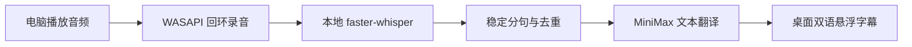

<div align="center">

# LinguaOverlay

### Windows 实时双语桌面字幕

捕获电脑正在播放的日语或英语，使用本地 Whisper 识别，调用 MiniMax
翻译成中文字幕，并以可置顶、可穿透的悬浮字幕显示在桌面上。


**本地识别 · AI 翻译 · 双语字幕 · 隐私友好**

</div>

---

## 工具能做什么

LinguaOverlay 面向观看日剧、动画、直播、课程、会议和英文视频等场景。
它直接捕获 Windows 播放设备的声音，不要求视频平台提供字幕，也不需要使用
麦克风。

| 能力 | 说明 |
| --- | --- |
| 系统音频捕获 | 通过 Windows WASAPI Loopback 捕获耳机或扬声器声音 |
| 本地语音识别 | 使用 `faster-whisper` 在本机识别日语和英语 |
| AI 中文字幕 | 将稳定句子发送给 MiniMax，生成自然的简体中文字幕 |
| 双语显示 | 支持同时显示原文和译文，也可以隐藏原文 |
| 桌面悬浮窗 | 无边框、始终置顶、可拖动、可调透明度 |
| 鼠标穿透 | 锁定后不会影响操作视频播放器或游戏 |
| 上下文翻译 | 保留最近字幕上下文，改善人名、代词和语气一致性 |
| 离线降级 | 未配置 API Key 时仍可使用模拟翻译测试识别链路 |

## 工作原理



> [!NOTE]
> 原始音频不会发送给 MiniMax。语音识别在本机完成，只有识别后的文本会发送到
> MiniMax 翻译接口。

## 快速开始

### 1. 下载项目

```powershell
git clone https://github.com/hy-8/LinguaOverlay.git
cd LinguaOverlay
```

### 2. 安装运行环境

使用 NVIDIA 显卡：

```powershell
.\install.ps1 -InstallCudaRuntime
```

安装脚本会在仓库内创建 `.runtime`，不会修改已有的 Python 环境。
依赖、CUDA 运行库和 cuDNN 都安装在项目目录中。

CPU 模式只需运行：

```powershell
.\install.ps1
```

然后按照 [REQUIREMENT.md](REQUIREMENT.md) 修改 CPU 配置。

### 3. 配置 MiniMax

```powershell
Copy-Item .env.example .env
notepad .env
```

填写自己的密钥：

```dotenv
MINIMAX_API_KEY=your_api_key_here
MINIMAX_BASE_URL=https://api.minimaxi.com/v1
MINIMAX_MODEL=MiniMax-M2.7-highspeed
```

- 中国大陆 MiniMax 账号通常使用 `https://api.minimaxi.com/v1`
- 海外账号通常使用 `https://api.minimax.io/v1`
- `.env` 已被 Git 忽略，不会随正常提交上传

### 4. 启动

双击：

```text
启动实时字幕.bat
```

或者使用 PowerShell：

```powershell
.\run.ps1
```

首次启动会下载 Whisper 模型，请等待下载和加载完成。

## 使用方式

- 拖动字幕窗口空白处，可以调整字幕位置。
- 点击“原文”，可以显示或隐藏原文。
- 点击“锁定”，字幕窗口将进入鼠标穿透状态。
- 锁定后可通过 Windows 系统托盘菜单解除锁定或退出。
- 字幕字体、透明度、语言和模型配置位于
  [`config/settings.json`](config/settings.json)。

## 常用命令

```powershell
# 检查 Python、CUDA、显卡和音频设备
.\run.ps1 -Diagnose

# 列出可以捕获的播放设备
.\run.ps1 -ListDevices

# 不调用 MiniMax，使用模拟译文测试完整流程
.\run.ps1 -Mock

# 启动后在 20 秒时自动退出，用于烟雾测试
.\run.ps1 -Mock -SmokeSeconds 20

# 运行自动化测试
.\.runtime\python.exe -m pytest -q
```

## 推荐配置

项目已在以下环境完成端到端测试：

- Windows 11
- NVIDIA GeForce RTX 5060 Laptop GPU 8GB
- CUDA 12.8 + cuDNN 9
- `large-v3-turbo`
- MiniMax `MiniMax-M2.7-highspeed`

默认 GPU 配置：

```json
{
  "whisper_model": "large-v3-turbo",
  "whisper_device": "cuda",
  "whisper_compute_type": "float16",
  "source_language": "auto"
}
```

观看单一语言内容时，将 `source_language` 固定为 `ja` 或 `en`，通常会比自动
语言检测更稳定。

## 隐私与仓库安全

以下内容默认不会被 Git 上传：

- `.env` 和 API Key
- `.runtime` 本地 Conda 环境
- `models` Whisper 模型
- `logs` 运行日志
- Python 缓存和测试缓存

提交前仍建议执行：

```powershell
git status --ignored
git grep -n "sk-api-"
```

如果 API Key 曾被提交到 Git 历史中，仅删除文件不够，应立即在 MiniMax
控制台撤销并重新生成密钥。

## 当前限制

- 主要支持 Windows，系统音频捕获依赖 WASAPI。
- 连续快速说话时通常会有约 2～6 秒延迟。
- 音乐、游戏音效和多人同时说话会降低识别质量。
- 首次下载 `large-v3-turbo` 模型需要稳定网络和约 2GB 磁盘空间。
- 当前仍是 MVP，设置主要通过 JSON 文件调整。

## 项目结构

```text
LinguaOverlay/
├── app.py
├── config/
│   └── settings.json
├── src/
│   ├── audio_capture.py
│   ├── buffer.py
│   ├── overlay.py
│   ├── pipeline.py
│   ├── stabilizer.py
│   ├── translator.py
│   └── whisper_engine.py
├── tests/
├── .env.example
├── install.ps1
├── run.ps1
├── requirements.txt
└── 启动实时字幕.bat
```

## 文档

- [完整环境要求与安装指南](REQUIREMENT.md)
- [MiniMax 配置模板](.env.example)
- [程序参数配置](config/settings.json)

---

<div align="center">

项目名称：**LinguaOverlay**

让没有中文字幕的声音，也能成为桌面上的实时双语字幕。

</div>
